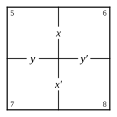

# THE GAME OF LOGIC

## By Lewis Carroll

COLOURS FOR\
COUNTERS

---

See the Sun is overhead,\
Shining on us, FULL and\
RED!

Now the Sun is gone away,\
And the EMPTY sky is\
GREY!

---

## THE GAME OF LOGIC

## By Lewis Carroll

To my Child-friend.

I charm in vain; for never again,\
All keenly as my glance I bend,\
    Will Memory, goddess coy,\
    Embody for my joy\
Departed days, nor let me gaze\
    On thee, my fairy friend!

Yet could thy face, in mystic grace,\
A moment smile on me, 'twould send\
    Far-darting rays of light\
    From Heaven athwart the night,\
By which to read in very deed\
    Thy spirit, sweetest friend!

So may the stream of Life's long dream\
Flow gently onward to its end,\
    With many a floweret gay,\
    Adown its willowy way:\
May no sigh vex, no care perplex,\
    My loving little friend!

## NOTA BENE.

With each copy of this Book is given an Envelope, containing a Diagram (similar to the frontispiece) on card, and nine Counters, four red and five grey.

The Envelope, etc. can be had separately, at 3d. each.

The Author will be very grateful for suggestions, especially from beginners in Logic, of any alterations, or further explanations, that may seem desirable.  Letters should be addressed to him at "29, Bedford Street, Covent Garden, London."

## PREFACE

"There foam'd rebellious Logic, gagg'd and bound."

This Game requires nine Counters—four of one colour and five of another:  say four red and five grey.

Besides the nine Counters, it also requires one Player, AT LEAST. I am not aware of any Game that can be played with LESS than this number:  while there are several that require MORE:  take Cricket, for instance, which requires twenty-two.  How much easier it is, when you want to play a Game, to find ONE Player than twenty-two. At the same time, though one Player is enough, a good deal more amusement may be got by two working at it together, and correcting each other's mistakes.

A second advantage, possessed by this Game, is that, besides being an endless source of amusement (the number of arguments, that may be worked by it, being infinite), it will give the Players a little instruction as well.  But is there any great harm in THAT, so long as you get plenty of amusement?

## CONTENTS.

| CHAPTER | | PAGE |
|---|---|---|
| **I.** | [NEW LAMPS FOR OLD.](01_new_lamps_for_old.md) |  |
| | [1. Propositions](01_new_lamps_for_old/01_propositions.md) | 1 |
| | [2. Syllogisms](01_new_lamps_for_old/02_syllogisms.md) | 20 |
| | [3. Fallacies](01_new_lamps_for_old/03_fallacies.md) | 32 |
| **II.** | [CROSS QUESTIONS.](02_cross_questions.md) |  |
| | [1. Elementary](02_cross_questions/01_elementary.md) | 37 |
| | [2. Half of Smaller Diagram. Propositions to be represented](02_cross_questions/02_half_smaller_propositions.md) | 40 |
| | [3. Do. Symbols to be interpreted](02_cross_questions/03_half_smaller_symbols.md) | 42 |
| | [4. Smaller Diagram.  Propositions to be represented](02_cross_questions/04_smaller_propositions.md) | 44 |
| | [5. Do. Symbols to be interpreted](02_cross_questions/05_smaller_symbols.md) | 46 |
| | [6. Larger Diagram.  Propositions to be represented](02_cross_questions/06_larger_diagram.md) | 48 |
| | [7. Both Diagrams to be employed](02_cross_questions/07_both_diagrams.md) | 51 |
| **III.** | [CROOKED ANSWERS.](03_crooked_answers.md) |  |
| | [1. Elementary](03_crooked_answers/01_elementary.md) | 55 |
| | [2. Half of Smaller Diagram.  Propositions represented](03_crooked_answers/02_half_smaller_propositions.md) | 59 |
| | [3. Do.  Symbols interpreted](03_crooked_answers/03_half_smaller_symbols.md) | 61 |
| | [4. Smaller Diagram. Propositions represented](03_crooked_answers/04_smaller_propositions.md) | 62 |
| | [5. Do.  Symbols interpreted](03_crooked_answers/05_smaller_symbols.md) | 65 |
| | [6. Larger Diagram. Propositions represented](03_crooked_answers/06_larger_diagram.md) | 67 |
| | [7. Both Diagrams employed](03_crooked_answers/07_both_diagrams.md) | 72 |
| **IV.** | [HIT OR MISS](04_hit_or_miss.md) | 85 |
