# CHAPTER II.

## CROSS QUESTIONS.

"The Man in the Wilderness asked of me\
'How many strawberries grow in the sea?'"

### 1. Elementary.

1.  What is an 'Attribute'?  Give examples.

2.  When is it good sense to put "is" or "are" between two names? Give examples.

3.  When is it NOT good sense?  Give examples.

4.  When it is NOT good sense, what is the simplest agreement to make, in order to make good sense?

5.  Explain 'Proposition', 'Term', 'Subject', and 'Predicate'. Give examples.

6.  What are 'Particular' and 'Universal' Propositions?  Give examples.

7.  Give a rule for knowing, when we look at the smaller Diagram, what Attributes belong to the things in each compartment.

8.  What does "some" mean in Logic?

9.  In what sense do we use the word 'Universe' in this Game?

10.  What is a 'Double' Proposition?  Give examples.

11.  When is a class of Things said to be 'exhaustively' divided? Give examples.

12.  Explain the phrase "sitting on the fence."

13.  What two partial Propositions make up, when taken together, "all $x$ are $y$"?

14.  What are 'Individual' Propositions?  Give examples.

15.  What kinds of Propositions imply, in this Game, the EXISTENCE of their Subjects?

16.  When a Proposition contains more than two Attributes, these Attributes may in some cases be re-arranged, and shifted from one Term to the other.  In what cases may this be done?  Give examples.

---

Break up each of the following into two partial Propositions:

17.  All tigers are fierce.

18.  All hard-boiled eggs are unwholesome.

19.  I am happy.

20.  John is not at home.

---

21.  Give a rule for knowing, when we look at the larger Diagram, what Attributes belong to the Things contained in each compartment.

22.  Explain 'Premises', 'Conclusion', and 'Syllogism'.  Give examples.

23.  Explain the phrases 'Middle Term' and 'Middle Terms'.

24.  In marking a pair of Premises on the larger Diagram, why is it best to mark NEGATIVE Propositions before AFFIRMATIVE ones?

25.  Why is it of no consequence to us, as Logicians, whether the Premises are true or false?

26.  How can we work Syllogisms in which we are told that "some $x$ are $y$" is to be understood to mean "the Attribute $x$, $y$ are COMPATIBLE", and "no $x$ are $y$" to mean "the Attributes $x$, $y$ are INCOMPATIBLE"?

27.  What are the two kinds of 'Fallacies'?

28.  How may we detect 'Fallacious Premises'?

29.  How may we detect a 'Fallacious Conclusion'?

30.  Sometimes the Conclusion, offered to us, is not identical with the correct Conclusion, and yet cannot be fairly called 'Fallacious'. When does this happen?  And what name may we give to such a Conclusion?

### 2.  Half of Smaller Diagram.

Propositions to be represented.

---

1.  Some $x$ are not-$y$.

2.  All $x$ are not-$y$.

3.  Some $x$ are $y$, and some are not-$y$.

4.  No $x$ exist.

5.  Some $x$ exist.

6.  No $x$ are not-$y$.

7.  Some $x$ are not-$y$, and some $x$ exist.

---

Taking $x$="judges"; $y$="just";

8.  No judges are just.

9.  Some judges are unjust.

10.  All judges are just.

---

Taking $x$="plums"; $y$="wholesome";

11.  Some plums are wholesome.

12.  There are no wholesome plums.

13.  Plums are some of them wholesome, and some not.

14.  All plums are unwholesome.

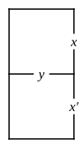

---

Taking $y$="diligent students"; $x$="successful";

15.  No diligent students are unsuccessful.

16.  All diligent students are successful.

17.  No students are diligent.

18.  There are some diligent, but unsuccessful, students.

19.  Some students are diligent.

### 3.  Half of Smaller Diagram.

Symbols to be interpreted.

---

---

**1.** \
**2.** 

**3.** 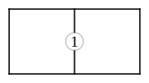\
**4.** 

---

Taking $x$="good riddles"; $y$="hard";

**5.** \
**6.** 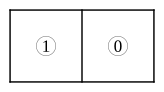

**7.** \
**8.** 

---

Taking $x$="lobster"; $y$="selfish";

**9.** \
**10.** 

**11.** \
**12.** 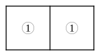

---

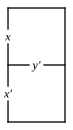

Taking $y$="healthy people"; $x$="happy";

**13.** 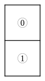\
**14.** 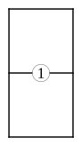\
**15.** 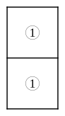\
**16.** 

### 4.  Smaller Diagram.

Propositions to be represented.

---

1.  All $y$ are $x$.

2.  Some $y$ are not-$x$.

3.  No not-$x$ are not-$y$.

4.  Some $x$ are not-$y$.

5.  Some not-$y$ are $x$.

6.  No not-$x$ are $y$.

7.  Some not-$x$ are not-$y$.

8.  All not-$x$ are not-$y$.

9.  Some not-$y$ exist.

10.  No not-$x$ exist.

11.  Some $y$ are $x$, and some are not-$x$.

12.  All $x$ are $y$, and all not-$y$ are not-$x$.

Taking "nations" as Universe; $x$="civilized"; $y$="warlike";

13.  No uncivilized nation is warlike.

14.  All unwarlike nations are uncivilized.

15.  Some nations are unwarlike.

16.  All warlike nations are civilized, and all civilized nations are warlike.

17.  No nation is uncivilized.

---

Taking "crocodiles" as Universe; $x$="hungry"; and $y$="amiable";

18.  All hungry crocodiles are unamiable.

19.  No crocodiles are amiable when hungry.

20.  Some crocodiles, when not hungry, are amiable; but some are not.

21.  No crocodiles are amiable, and some are hungry.

22.  All crocodiles, when not hungry, are amiable; and all unamiable crocodiles are hungry.

23.  Some hungry crocodiles are amiable, and some that are not hungry are unamiable.

### 5.  Smaller Diagram.

Symbols to be interpreted.

---

---

**1.** \
**2.** 

**3.** 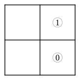\
**4.** 

---

Taking "houses" as Universe; $x$="built of brick"; and $y$="two-storied"; interpret

**5.** \
**6.** 

**7.** \
**8.** 

Taking "boys" as Universe; $x$="fat"; and $y$="active"; interpret

**9.** \
**10.** 

**11.** \
**12.** 

---

Taking "cats" as Universe; $x$="green-eyed"; and $y$="good-tempered"; interpret

**13.** \
**14.** 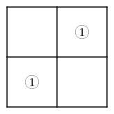

**15.** 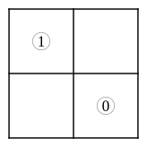\
**16.** 

### 6.  Larger Diagram.

Propositions to be represented.

---

---

1.  No $x$ are $m$.

2.  Some $y$ are $m'$.

3.  All $m$ are $x'$.

4.  No $m'$ are $y'$.

5.  No $m$ are $x$; All $y$ are $m$.

6.  Some $x$ are $m$; No $y$ are $m$.

7.  All $m$ are $x'$; No $m$ are $y$.

8.  No $x'$ are $m$; No $y'$ are $m'$.

Taking "rabbits" as Universe; $m$="greedy"; $x$="old"; and $y$="black"; represent

9.  No old rabbits are greedy.

10.  Some not-greedy rabbits are black.

11.  All white rabbits are free from greediness.

12.  All greedy rabbits are young.

13.  No old rabbits are greedy; All black rabbits are greedy.

14.  All rabbits, that are not greedy, are black; No old rabbits are free from greediness.

---

Taking "birds" as Universe; $m$="that sing loud"; $x$="well-fed"; and $y$="happy"; represent

15.  All well-fed birds sing loud; No birds, that sing loud, are unhappy.

16.  All birds, that do not sing loud, are unhappy; No well-fed birds fail to sing loud.

---

Taking "persons" as Universe; $m$="in the house"; $x$="John"; and $y$="having a tooth-ache"; represent

17.  John is in the house; Everybody in the house is suffering from tooth-ache.

18.  There is no one in the house but John; Nobody, out of the house, has a tooth-ache.

---

Taking "persons" as Universe; $m$="I"; $x$="that has taken a walk"; $y$="that feels better"; represent

19.  I have been out for a walk; I feel much better.

---

Choosing your own 'Universe' etc., represent

20.  I sent him to bring me a kitten; He brought me a kettle by mistake.

### 7.  Both Diagrams to be employed.

---

\
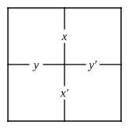

---

N.B.  In each Question, a small Diagram should be drawn, for $x$ and $y$ only, and marked in accordance with the given large Diagram: and then as many Propositions as possible, for $x$ and $y$, should be read off from this small Diagram.

**1.** \
**2.** 

**3.** \
**4.** 

---

Mark, in a large Diagram, the following pairs of Propositions from the preceding Section: then mark a small Diagram in accordance with it, etc.

5.  No. 13.    9.  No. 17.\
6.  No. 14.               10.  No. 18.\
7.  No. 15.               11.  No. 19.\
8.  No. 16.               12.  No. 20.

---

Mark, on a large Diagram, the following Pairs of Propositions: then mark a small Diagram, etc.  These are, in fact, Pairs of PREMISES for Syllogisms: and the results, read off from the small Diagram, are the CONCLUSIONS.

13.  No exciting books suit feverish patients; Unexciting books make one drowsy.

14.  Some, who deserve the fair, get their deserts; None but the brave deserve the fair.

15.  No children are patient; No impatient person can sit still.

16.  All pigs are fat; No skeletons are fat.

17.  No monkeys are soldiers; All monkeys are mischievous.

18.  None of my cousins are just; No judges are unjust.

19.  Some days are rainy; Rainy days are tiresome.

20.  All medicine is nasty; Senna is a medicine.

21.  Some Jews are rich; All Patagonians are Gentiles.

22.  All teetotalers like sugar; No nightingale drinks wine.

23.  No muffins are wholesome; All buns are unwholesome.

24.  No fat creatures run well; Some greyhounds run well.

25.  All soldiers march; Some youths are not soldiers.

26.  Sugar is sweet; Salt is not sweet.

27.  Some eggs are hard-boiled; No eggs are uncrackable.

28.  There are no Jews in the house; There are no Gentiles in the garden.

29.  All battles are noisy; What makes no noise may escape notice.

30.  No Jews are mad; All Rabbis are Jews.

31.  There are no fish that cannot swim; Some skates are fish.

32.  All passionate people are unreasonable; Some orators are passionate.
