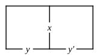

# CHAPTER II.

## CROSS QUESTIONS.

### 2.  Half of Smaller Diagram.

Propositions to be represented.

---

1.  Some $x$ are not-$y$.

2.  All $x$ are not-$y$.

3.  Some $x$ are $y$, and some are not-$y$.

4.  No $x$ exist.

5.  Some $x$ exist.

6.  No $x$ are not-$y$.

7.  Some $x$ are not-$y$, and some $x$ exist.

---

Taking $x$="judges"; $y$="just";

8.  No judges are just.

9.  Some judges are unjust.

10.  All judges are just.

---

Taking $x$="plums"; $y$="wholesome";

11.  Some plums are wholesome.

12.  There are no wholesome plums.

13.  Plums are some of them wholesome, and some not.

14.  All plums are unwholesome.

---

Taking $y$="diligent students"; $x$="successful";

15.  No diligent students are unsuccessful.

16.  All diligent students are successful.

17.  No students are diligent.

18.  There are some diligent, but unsuccessful, students.

19.  Some students are diligent.

