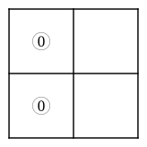
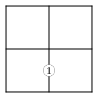
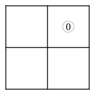
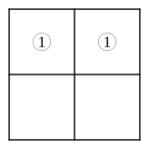
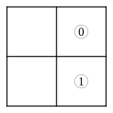
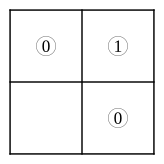
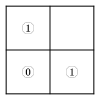
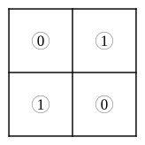

# CHAPTER II.

## CROSS QUESTIONS.

### 5.  Smaller Diagram.

Symbols to be interpreted.

---

---

**1.** \
**2.** 

**3.** \
**4.** 

---

Taking "houses" as Universe; $x$="built of brick"; and $y$="two-storied"; interpret

**5.** \
**6.** 

**7.** \
**8.** 

Taking "boys" as Universe; $x$="fat"; and $y$="active"; interpret

**9.** \
**10.** 

**11.** \
**12.** 

---

Taking "cats" as Universe; $x$="green-eyed"; and $y$="good-tempered"; interpret

**13.** \
**14.** 

**15.** \
**16.** 

