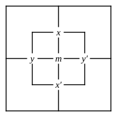

# CHAPTER II.

## CROSS QUESTIONS.

### 7.  Both Diagrams to be employed.

---

\

---

N.B.  In each Question, a small Diagram should be drawn, for $x$ and $y$ only, and marked in accordance with the given large Diagram: and then as many Propositions as possible, for $x$ and $y$, should be read off from this small Diagram.

**1.** \
**2.** 

**3.** \
**4.** 

---

Mark, in a large Diagram, the following pairs of Propositions from the preceding Section: then mark a small Diagram in accordance with it, etc.

5.  No. 13.    9.  No. 17.\
6.  No. 14.               10.  No. 18.\
7.  No. 15.               11.  No. 19.\
8.  No. 16.               12.  No. 20.

---

Mark, on a large Diagram, the following Pairs of Propositions: then mark a small Diagram, etc.  These are, in fact, Pairs of PREMISES for Syllogisms: and the results, read off from the small Diagram, are the CONCLUSIONS.

13.  No exciting books suit feverish patients; Unexciting books make one drowsy.

14.  Some, who deserve the fair, get their deserts; None but the brave deserve the fair.

15.  No children are patient; No impatient person can sit still.

16.  All pigs are fat; No skeletons are fat.

17.  No monkeys are soldiers; All monkeys are mischievous.

18.  None of my cousins are just; No judges are unjust.

19.  Some days are rainy; Rainy days are tiresome.

20.  All medicine is nasty; Senna is a medicine.

21.  Some Jews are rich; All Patagonians are Gentiles.

22.  All teetotalers like sugar; No nightingale drinks wine.

23.  No muffins are wholesome; All buns are unwholesome.

24.  No fat creatures run well; Some greyhounds run well.

25.  All soldiers march; Some youths are not soldiers.

26.  Sugar is sweet; Salt is not sweet.

27.  Some eggs are hard-boiled; No eggs are uncrackable.

28.  There are no Jews in the house; There are no Gentiles in the garden.

29.  All battles are noisy; What makes no noise may escape notice.

30.  No Jews are mad; All Rabbis are Jews.

31.  There are no fish that cannot swim; Some skates are fish.

32.  All passionate people are unreasonable; Some orators are passionate.
