# CHAPTER III.

## CROOKED ANSWERS.

"I answered him, as I thought good,\
'As many as red-herrings grow in the wood'."

---

### 1.  Elementary.

1.  Whatever can be "attributed to", that is "said to belong to", a Thing, is called an 'Attribute'.  For example, "baked", which can (frequently) be attributed to "Buns", and "beautiful", which can (seldom) be attributed to "Babies".

2.  When they are the Names of two Things (for example, "these Pigs are fat Animals"), or of two Attributes (for example, "pink is light red").

3.  When one is the Name of a Thing, and the other the Name of an Attribute (for example, "these Pigs are pink"), since a Thing cannot actually BE an Attribute.

4.  That the Substantive shall be supposed to be repeated at the end of the sentence (for example, "these Pigs are pink (Pigs)").

5.  A 'Proposition' is a sentence stating that some, or none, or all, of the Things belonging to a certain class, called the 'Subject', are also Things belonging to a certain other class, called the 'Predicate'.  For example, "some new Cakes are not nice", that is (written in full) "some new Cakes are not nice Cakes"; where the class "new Cakes" is the Subject, and the class "not-nice Cakes" is the Predicate.

6.  A Proposition, stating that SOME of the Things belonging to its Subject are so-and-so, is called 'Particular'.  For example, "some new Cakes are nice", "some new Cakes are not nice."

A Proposition, stating that NONE of the Things belonging to its Subject, or that ALL of them, are so-and-so, is called 'Universal'. For example, "no new Cakes are nice", "all new Cakes are not nice".

7.  The Things in each compartment possess TWO Attributes, whose symbols will be found written on two of the EDGES of that compartment.

8.  "One or more."

9.  As a name of the class of Things to which the whole Diagram is assigned.

10.  A Proposition containing two statements.  For example, "some new Cakes are nice and some are not-nice."

11.  When the whole class, thus divided, is "exhausted" among the sets into which it is divided, there being no member of it which does not belong to some one of them.  For example, the class "new Cakes" is "exhaustively" divided into "nice" and "not-nice" since EVERY new Cake must be one or the other.

12.  When a man cannot make up his mind which of two parties he will join, he is said to be "sitting on the fence"—not being able to decide on which side he will jump down.

13.  "Some $x$ are $y$" and "no $x$ are $y'$".

14.  A Proposition, whose Subject is a single Thing, is called 'Individual'.  For example, "I am happy", "John is not at home". These are Universal Propositions, being the same as "all the I's that exist are happy", "ALL the Johns, that I am now considering, are not at home".

15.  Propositions beginning with "some" or "all".

16.  When they begin with "some" or "no".  For example, "some abc are def" may be re-arranged as "some bf are acde", each being equivalent to "some abcdef exist".

17.  Some tigers are fierce, No tigers are not-fierce.

18.  Some hard-boiled eggs are unwholesome, No hard-boiled eggs are wholesome.

19.  Some I's are happy, No I's are unhappy.

20.  Some Johns are not at home, No Johns are at home.

21.  The Things, in each compartment of the larger Diagram, possess THREE Attributes, whose symbols will be found written at three of the CORNERS of the compartment (except in the case of $m'$, which is not actually inserted in the Diagram, but is SUPPOSED to stand at each of its four outer corners).

22.  If the Universe of Things be divided with regard to three different Attributes; and if two Propositions be given, containing two different couples of these Attributes; and if from these we can prove a third Proposition, containing the two Attributes that have not yet occurred together; the given Propositions are called 'the Premises', the third one 'the Conclusion', and the whole set 'a Syllogism'.  For example, the Premises might be "no $m$ are $x'$" and "all $m'$ are $y$"; and it might be possible to prove from them a Conclusion containing $x$ and $y$.

23.  If an Attribute occurs in both Premises, the Term containing it is called 'the Middle Term'.  For example, if the Premises are "some $m$ are $x$" and "no $m$ are $y'$", the class of "$m$-Things" is 'the Middle Term.'

If an Attribute occurs in one Premise, and its contradictory in the other, the Terms containing them may be called 'the Middle Terms'. For example, if the Premises are "no $m$ are $x'$" and "all $m'$ are $y$", the two classes of "$m$-Things" and "$m'$-Things" may be called 'the Middle Terms'.

24.  Because they can be marked with CERTAINTY: whereas AFFIRMATIVE Propositions (that is, those that begin with "some" or "all") sometimes require us to place a red counter 'sitting on a fence'.

25.  Because the only question we are concerned with is whether the Conclusion FOLLOWS LOGICALLY from the Premises, so that, if THEY were true, IT also would be true.

26.  By understanding a red counter to mean "this compartment CAN be occupied", and a grey one to mean "this compartment CANNOT be occupied" or "this compartment MUST be empty".

27.  'Fallacious Premises' and 'Fallacious Conclusion'.

28.  By finding, when we try to transfer marks from the larger Diagram to the smaller, that there is 'no information' for any of its four compartments.

29.  By finding the correct Conclusion, and then observing that the Conclusion, offered to us, is neither identical with it nor a part of it.

30.  When the offered Conclusion is PART of the correct Conclusion. In this case, we may call it a 'Defective Conclusion'.

### 2.  Half of Smaller Diagram.

Propositions represented.

---

**1.** \
**2.** 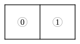

**3.** \
**4.** 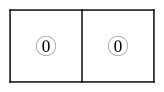

**5.** \
**6.** 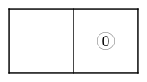

**7.**  It might be thought that the proper Diagram would be 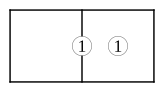, in order to express "some $x$ exist": but this is really contained in "some $x$ are $y'$." To put a red counter on the division-line would only tell us "ONE OF THE compartments is occupied", which we know already, in knowing that ONE is occupied.

**8.**  No $x$ are $y$.  i.e.  

**9.** Some $x$ are $y'$.  i.e. 

**10.** All $x$ are $y$.  i.e. 

**11.** Some $x$ are $y$.  i.e. 

**12.** No $x$ are $y$.  i.e. 

**13.** Some $x$ are $y$, and some are $y'$.  i.e. 

**14.** All $x$ are $y'$.  i.e. 

**15.** No $y$ are $x'$.  i.e. 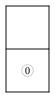

**16.** All $y$ are $x$.  i.e. 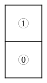

**17.** No $y$ exist.  i.e. 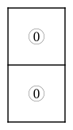

**18.** Some $y$ are $x'$.  i.e. 

**19.** Some $y$ exist.  i.e. 

### 3.  Half of Smaller Diagram.

Symbols interpreted.

---

1.  No $x$ are $y'$.

2.  No $x$ exist.

3.  Some $x$ exist.

4.  All $x$ are $y'$.

5.  Some $x$ are $y$.  i.e. Some good riddles are hard.

6.  All $x$ are $y$.  i.e. All good riddles are hard.

7.  No $x$ exist.  i.e. No riddles are good.

8.  No $x$ are $y$.  i.e. No good riddles are hard.

9.  Some $x$ are $y'$.  i.e. Some lobsters are unselfish.

10.  No $x$ are $y$.  i.e. No lobsters are selfish.

11.  All $x$ are $y'$.  i.e. All lobsters are unselfish.

12.  Some $x$ are $y$, and some are $y'$.  i.e. Some lobsters are selfish, and some are unselfish.

13.  All $y'$ are $x'$.  i.e. All invalids are unhappy.

14.  Some $y'$ exist.  i.e. Some people are unhealthy.

15.  Some $y'$ are $x$, and some are $x'$.  i.e. Some invalids are happy, and some are unhappy.

16.  No $y'$ exist.  i.e. Nobody is unhealthy.

### 4.  Smaller Diagram.

Propositions represented.

---

**1.** \
**2.** 

**3.** \
**4.** 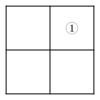

**5.** \
**6.** 

**7.** \
**8.** 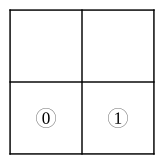

**9.** \
**10.** 

**11.** 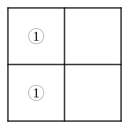\
**12.** 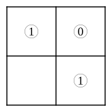

**13.** No $x'$ are $y$.  i.e. 

**14.** All $y'$ are $x'$.  i.e. 

**15.** Some $y'$ exist.  i.e. 

**16.** All $y$ are $x$, and all $x$ are $y$.  i.e. 

**17.** No $x'$ exist.  i.e. 

**18.** All $x$ are $y'$.  i.e. 

**19.** No $x$ are $y$.  i.e. 

**20.** Some $x'$ are $y$, and some are $y'$.  i.e. 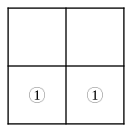

**21.** No $y$ exist, and some $x$ exist.  i.e. 

**22.** All $x'$ are $y$, and all $y'$ are $x$.  i.e. 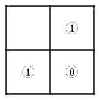

**23.** Some $x$ are $y$, and some $x'$ are $y'$.  i.e. 

### 5.  Smaller Diagram.

Symbols interpreted.

---

1.  Some $y$ are not-$x$, or, Some not-$x$ are $y$.

2.  No not-$x$ are not-$y$, or, No not-$y$ are not-$x$.

3.  No not-$y$ are $x$.  *[A note from the editor of this edition: the diagram for this exercise, back in Chapter II, does not agree with this answer. Read that diagram again yourself: does it say that NO not-$y$ are $x$, or that ALL not-$y$ are $x$? One of the two is wrong, and has been wrong ever since the book was printed in 1887 — it is not a slip made in copying it out. Work out which one you believe, and tell whoever gave you this book.]*

4.  No not-$x$ exist.  i.e.  No Things are not-$x$.

5.  No $y$ exist.  i.e.  No houses are two-storied.

6.  Some $x'$ exist.  i.e.  Some houses are not built of brick.

7.  No $x$ are $y'$.  Or, no $y'$ are $x$.  i.e.  No houses, built of brick, are other than two-storied.  Or, no houses, that are not two-storied, are built of brick.

8.  All $x'$ are $y'$.  i.e.  All houses, that are not built of brick, are not two-storied.

9.  Some $x$ are $y$, and some are $y'$.  i.e.  Some fat boys are active, and some are not.

10.  All $y'$ are $x'$.  i.e.  All lazy boys are thin.

11.  All $x$ are $y'$, and all $y'$ are $x$.  i.e.  All fat boys are lazy, and all lazy ones are fat.

12.  All $y$ are $x$, and all $x'$ are $y'$.  i.e.  All active boys are fat, and all thin ones are lazy.

13.  No $x$ exist, and no $y'$ exist.  i.e.  No cats have green eyes, and none have bad tempers.

14.  Some $x$ are $y'$, and some $x'$ are $y$.  Or some $y$ are $x'$, and some $y'$ are $x$.  i.e.  Some green-eyed cats are bad-tempered, and some, that have not green eyes, are good-tempered. Or, some good-tempered cats have not green eyes, and some bad-tempered ones have green eyes.

15.  Some $x$ are $y$, and no $x'$ are $y'$.  Or, some $y$ are $x$, and no $y'$ are $x'$.  i.e.  Some green-eyed cats are good-tempered, and none, that are not green-eyed, are bad-tempered.  Or, some good-tempered cats have green eyes, and none, that are bad-tempered, have not green eyes.

16.  All $x$ are $y'$, and all $x'$ are $y$.  Or, all $y$ are $x'$, and all $y'$ are $x$.  i.e.  All green-eyed cats are bad-tempered and all, that have not green eyes, are good-tempered.  Or, all good-tempered ones have eyes that are not green, and all bad-tempered ones have green eyes.

### 6.  Larger Diagram.

Propositions represented.

---

**1.** 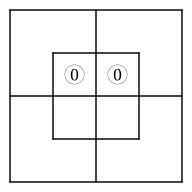\
**2.** 

**3.** \
**4.** 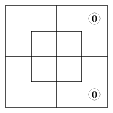

**5.** \
**6.** 

**7.** \
**8.** 

**9.** No $x$ are $m$.  i.e. 

**10.** Some $m'$ are $y$.  i.e. 

**11.** All $y'$ are $m'$.  i.e. 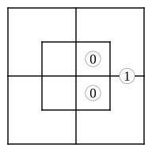

**12.** All $m$ are $x'$.  i.e. 

**13.** No $x$ are $m$;       i.e. All $y$ are $m$. 

**14.** All $m'$ are $y$;      i.e. No $x$ are $m'$. 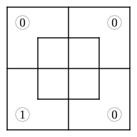

**15.** All $x$ are $m$;      i.e. No $m$ are $y'$. 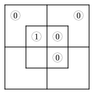

**16.** All $m'$ are $y'$;      i.e. No $x$ are $m'$. 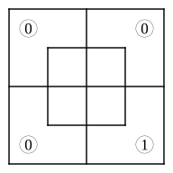

**17.** All $x$ are $m$;       i.e. All $m$ are $y$. [See remarks on No. 7, § 2.] 

**18.** No $x'$ are $m$;      i.e. No $m'$ are $y$. 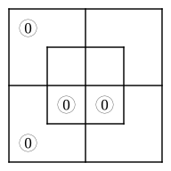

**19.** All $m$ are $x$;      i.e. All $m$ are $y$. 

20.  We had better take "persons" as Universe.  We may choose "myself" as 'Middle Term', in which case the Premises will take the form

I am a-person-who-sent-him-to-bring-a-kitten;\
I am a-person-to-whom-he-brought-a-kettle-by-mistake.

Or we may choose "he" as 'Middle Term', in which case the Premises will take the form

He is a-person-whom-I-sent-to-bring-me-a-kitten;\
He is a-person-who-brought-me-a-kettle-by-mistake.

The latter form seems best, as the interest of the anecdote clearly depends on HIS stupidity—not on what happened to ME.  Let us then make $m$ = "he"; $x$ = "persons whom I sent, etc."; and $y$ = "persons who brought, etc."

Hence, All $m$ are $x$;\
All $m$ are $y$.    and the required Diagram is

### 7.  Both Diagrams employed.

**1.**  i.e.  All $y$ are $x'$.

**2.**  i.e.  Some $x$ are $y'$; or, Some $y'$ are $x$.

**3.**  i.e.  Some $y$ are $x'$; or, Some $x'$ are $y$.

**4.**  i.e.  No $x'$ are $y'$; or, No $y'$ are $x'$.

**5.**  i.e.  All $y$ are $x'$.  i.e.  All black rabbits are young.

**6.**  i.e.  Some $y$ are $x'$.  i.e. Some black rabbits are young.

**7.**  i.e.  All $x$ are $y$.  i.e. All well-fed birds are happy.

**8.**  i.e.  Some $x'$ are $y'$.  i.e.  Some birds, that are not well-fed, are unhappy; or, Some unhappy birds are not well-fed.

**9.**  i.e.  All $x$ are $y$.  i.e.  John has got a tooth-ache.

**10.** 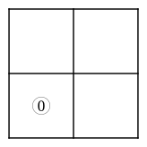 i.e.  No $x'$ are $y$.  i.e.  No one, but John, has got a tooth-ache.

**11.**  i.e.  Some $x$ are $y$.  i.e. Some one, who has taken a walk, feels better.

**12.**  i.e.  Some $x$ are $y$.  i.e.  Some one, whom I sent to bring me a kitten, brought me a kettle by mistake.

**13.** 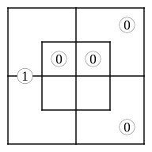 

Let "books" be Universe; $m$="exciting",\
$x$="that suit feverish patients"; $y$="that make\
one drowsy".

No $m$ are $x$; $\therefore$ No $y'$ are $x$.\
All $m'$ are $y$.

i.e.  No books suit feverish patients, except such as make\
one drowsy.

**14.**  

Let "persons" be Universe; $m$="that deserve the fair";\
$x$="that get their deserts"; $y$="brave".

Some $m$ are $x$; $\therefore$ Some $y$ are $x$.\
No $y'$ are $m$.

i.e. Some brave persons get their deserts.

**15.** 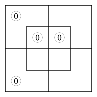 

Let "persons" be Universe; $m$="patient";\
$x$="children"; $y$="that can sit still".

No $x$ are $m$; $\therefore$ No $x$ are $y$.\
No $m'$ are $y$.

i.e.  No children can sit still.

**16.** 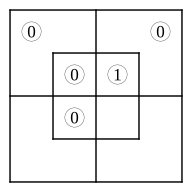 

Let "things" be Universe; $m$="fat"; $x$="pigs";\
$y$="skeletons".

All $x$ are $m$; $\therefore$ All $x$ are $y'$.\
No $y$ are $m$.

i.e.  All pigs are not-skeletons.

**17.**  

Let "creatures" be Universe; $m$="monkeys";\
$x$="soldiers"; $y$="mischievous".

No $m$ are $x$; $\therefore$ Some $y$ are $x'$.\
All $m$ are $y$.

i.e.  Some mischievous creatures are not soldiers.

**18.**  

Let "persons" be Universe; $m$="just";\
$x$="my cousins"; $y$="judges".

No $x$ are $m$; $\therefore$ No $x$ are $y$.\
No $y$ are $m'$.

i.e.  None of my cousins are judges.

**19.**  

Let "periods" be Universe; $m$="days";\
$x$="rainy"; $y$="tiresome".

Some $m$ are $x$; $\therefore$ Some $x$ are $y$.\
All $xm$ are $y$.

i.e.  Some rainy periods are tiresome.

N.B.  These are not legitimate Premises, since the Conclusion is really part of the second Premise, so that the first Premise is superfluous.  This may be shown, in letters, thus:

"All $xm$ are $y$" contains "Some $xm$ are $y$", which contains "Some $x$ are $y$".  Or, in words, "All rainy days are tiresome" contains "Some rainy days are tiresome", which contains "Some rainy periods are tiresome".

Moreover, the first Premise, besides being superfluous, is actually contained in the second; since it is equivalent to "Some rainy days exist", which, as we know, is implied in the Proposition "All rainy days are tiresome".

Altogether, a most unsatisfactory Pair of Premises!

**20.**  

Let "things" be Universe; $m$="medicine";\
$x$="nasty"; $y$="senna".

All $m$ are $x$; $\therefore$ All $y$ are $x$.\
All $y$ are $m$.

i.e.  Senna is nasty.

[See remarks on No. 7, § 2.]

**21.** 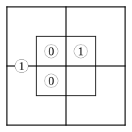 

Let "persons" be Universe; $m$="Jews";\
$x$="rich"; $y$="Patagonians".

Some $m$ are $x$; $\therefore$ Some $x$ are $y'$.\
All $y$ are $m'$.

i.e.  Some rich persons are not Patagonians.

**22.**  

Let "creatures" be Universe; $m$="teetotalers";\
$x$="that like sugar"; $y$="nightingales".

All $m$ are $x$; $\therefore$ No $y$ are $x'$.\
No $y$ are $m'$.

i.e.  No nightingales dislike sugar.

**23.**  

Let "food" be Universe; $m$="wholesome";\
$x$="muffins"; $y$="buns".

No $x$ are $m$;\
All $y$ are $m'$.

There is 'no information' for the smaller Diagram; so no Conclusion can be drawn.

**24.**  

Let "creatures" be Universe; $m$="that run well";\
$x$="fat"; $y$="greyhounds".

No $x$ are $m$; $\therefore$ Some $y$ are $x'$.\
Some $y$ are $m$.

i.e.  Some greyhounds are not fat.

**25.** 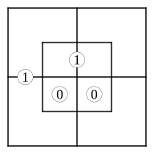 

Let "persons" be Universe; $m$="soldiers";\
$x$="that march"; $y$="youths".

All $m$ are $x$;\
Some $y$ are $m'$.

There is 'no information' for the smaller Diagram; so no Conclusion can be drawn.

**26.** 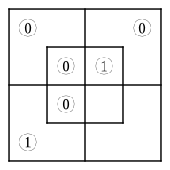 

Let "food" be Universe; $m$="sweet";\
$x$="sugar"; $y$="salt".

All $x$ are $m$;     $\therefore$      All $x$ are $y'$.\
All $y$ are $m'$.                 All $y$ are $x'$.

i.e.   Sugar is not salt.\
Salt is not sugar.

**27.** 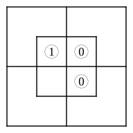 

Let "Things" be Universe; $m$="eggs";\
$x$="hard-boiled"; $y$="crackable".

Some $m$ are $x$; $\therefore$ Some $x$ are $y$.\
No $m$ are $y'$.

i.e.  Some hard-boiled things can be cracked.

**28.**  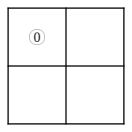

Let "persons" be Universe; $m$="Jews"; $x$="that\
are in the house"; $y$="that are in the garden".

No $m$ are $x$; $\therefore$ No $x$ are $y$.\
No $m'$ are $y$.

i.e.  No persons, that are in the house, are also in\
the garden.

**29.** 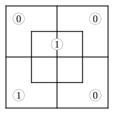 

Let "Things" be Universe; $m$="noisy";\
$x$="battles"; $y$="that may escape notice".

All $x$ are $m$; $\therefore$ Some $x'$ are $y$.\
All $m'$ are $y$.

i.e.  Some things, that are not battles, may escape notice.

**30.** 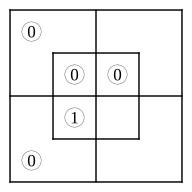 

Let "persons" be Universe; $m$="Jews";\
$x$="mad"; $y$="Rabbis".

No $m$ are $x$; $\therefore$ All $y$ are $x'$.\
All $y$ are $m$.

i.e.  All Rabbis are sane.

**31.**  

Let "Things" be Universe; $m$="fish";\
$x$="that can swim"; $y$="skates".

No $m$ are $x'$; $\therefore$ Some $y$ are $x$.\
Some $y$ are $m$.

i.e.  Some skates can swim.

**32.** 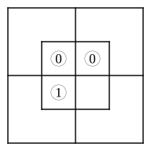 

Let "people" be Universe; $m$="passionate";\
$x$="reasonable"; $y$="orators".

All $m$ are $x'$; $\therefore$ Some $y$ are $x'$.\
Some $y$ are $m$.

i.e.  Some orators are unreasonable.

[See remarks on No. 7, § 2.]
