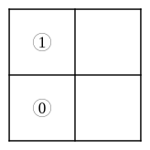
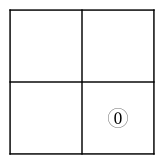
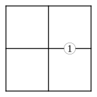
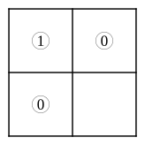
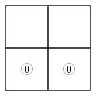
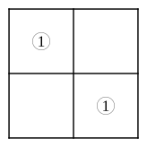

# CHAPTER III.

## CROOKED ANSWERS.

### 4.  Smaller Diagram.

Propositions represented.

---

**1.** \
**2.** 

**3.** \
**4.** 

**5.** \
**6.** 

**7.** \
**8.** 

**9.** \
**10.** 

**11.** \
**12.** 

**13.** No $x'$ are $y$.  i.e. 

**14.** All $y'$ are $x'$.  i.e. 

**15.** Some $y'$ exist.  i.e. 

**16.** All $y$ are $x$, and all $x$ are $y$.  i.e. 

**17.** No $x'$ exist.  i.e. 

**18.** All $x$ are $y'$.  i.e. 

**19.** No $x$ are $y$.  i.e. 

**20.** Some $x'$ are $y$, and some are $y'$.  i.e. 

**21.** No $y$ exist, and some $x$ exist.  i.e. 

**22.** All $x'$ are $y$, and all $y'$ are $x$.  i.e. 

**23.** Some $x$ are $y$, and some $x'$ are $y'$.  i.e. 

