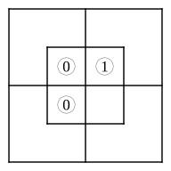
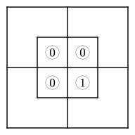
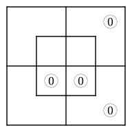
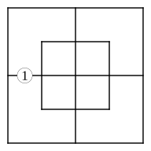
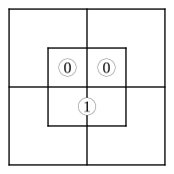
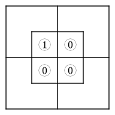

# CHAPTER III.

## CROOKED ANSWERS.

### 6.  Larger Diagram.

Propositions represented.

---

**1.** \
**2.** 

**3.** \
**4.** 

**5.** \
**6.** 

**7.** \
**8.** 

**9.** No $x$ are $m$.  i.e. 

**10.** Some $m'$ are $y$.  i.e. 

**11.** All $y'$ are $m'$.  i.e. 

**12.** All $m$ are $x'$.  i.e. 

**13.** No $x$ are $m$;       i.e. All $y$ are $m$. 

**14.** All $m'$ are $y$;      i.e. No $x$ are $m'$. 

**15.** All $x$ are $m$;      i.e. No $m$ are $y'$. 

**16.** All $m'$ are $y'$;      i.e. No $x$ are $m'$. 

**17.** All $x$ are $m$;       i.e. All $m$ are $y$. [See remarks on No. 7, § 2.] 

**18.** No $x'$ are $m$;      i.e. No $m'$ are $y$. 

**19.** All $m$ are $x$;      i.e. All $m$ are $y$. 

20.  We had better take "persons" as Universe.  We may choose "myself" as 'Middle Term', in which case the Premises will take the form

I am a-person-who-sent-him-to-bring-a-kitten;\
I am a-person-to-whom-he-brought-a-kettle-by-mistake.

Or we may choose "he" as 'Middle Term', in which case the Premises will take the form

He is a-person-whom-I-sent-to-bring-me-a-kitten;\
He is a-person-who-brought-me-a-kettle-by-mistake.

The latter form seems best, as the interest of the anecdote clearly depends on HIS stupidity—not on what happened to ME.  Let us then make $m$ = "he"; $x$ = "persons whom I sent, etc."; and $y$ = "persons who brought, etc."

Hence, All $m$ are $x$;\
All $m$ are $y$.    and the required Diagram is

