# CHAPTER III.

## CROOKED ANSWERS.

### 7.  Both Diagrams employed.

**1.** 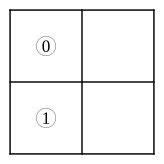 i.e.  All $y$ are $x'$.

**2.**  i.e.  Some $x$ are $y'$; or, Some $y'$ are $x$.

**3.**  i.e.  Some $y$ are $x'$; or, Some $x'$ are $y$.

**4.**  i.e.  No $x'$ are $y'$; or, No $y'$ are $x'$.

**5.**  i.e.  All $y$ are $x'$.  i.e.  All black rabbits are young.

**6.**  i.e.  Some $y$ are $x'$.  i.e. Some black rabbits are young.

**7.**  i.e.  All $x$ are $y$.  i.e. All well-fed birds are happy.

**8.** 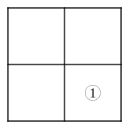 i.e.  Some $x'$ are $y'$.  i.e.  Some birds, that are not well-fed, are unhappy; or, Some unhappy birds are not well-fed.

**9.** 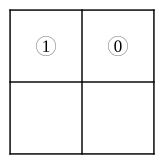 i.e.  All $x$ are $y$.  i.e.  John has got a tooth-ache.

**10.**  i.e.  No $x'$ are $y$.  i.e.  No one, but John, has got a tooth-ache.

**11.**  i.e.  Some $x$ are $y$.  i.e. Some one, who has taken a walk, feels better.

**12.** 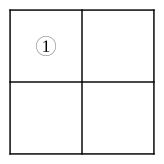 i.e.  Some $x$ are $y$.  i.e.  Some one, whom I sent to bring me a kitten, brought me a kettle by mistake.

**13.**  

Let "books" be Universe; $m$="exciting",\
$x$="that suit feverish patients"; $y$="that make\
one drowsy".

No $m$ are $x$; $\therefore$ No $y'$ are $x$.\
All $m'$ are $y$.

i.e.  No books suit feverish patients, except such as make\
one drowsy.

**14.**  

Let "persons" be Universe; $m$="that deserve the fair";\
$x$="that get their deserts"; $y$="brave".

Some $m$ are $x$; $\therefore$ Some $y$ are $x$.\
No $y'$ are $m$.

i.e. Some brave persons get their deserts.

**15.**  

Let "persons" be Universe; $m$="patient";\
$x$="children"; $y$="that can sit still".

No $x$ are $m$; $\therefore$ No $x$ are $y$.\
No $m'$ are $y$.

i.e.  No children can sit still.

**16.**  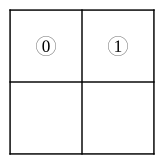

Let "things" be Universe; $m$="fat"; $x$="pigs";\
$y$="skeletons".

All $x$ are $m$; $\therefore$ All $x$ are $y'$.\
No $y$ are $m$.

i.e.  All pigs are not-skeletons.

**17.** 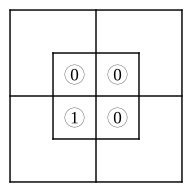 

Let "creatures" be Universe; $m$="monkeys";\
$x$="soldiers"; $y$="mischievous".

No $m$ are $x$; $\therefore$ Some $y$ are $x'$.\
All $m$ are $y$.

i.e.  Some mischievous creatures are not soldiers.

**18.**  

Let "persons" be Universe; $m$="just";\
$x$="my cousins"; $y$="judges".

No $x$ are $m$; $\therefore$ No $x$ are $y$.\
No $y$ are $m'$.

i.e.  None of my cousins are judges.

**19.** 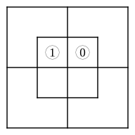 

Let "periods" be Universe; $m$="days";\
$x$="rainy"; $y$="tiresome".

Some $m$ are $x$; $\therefore$ Some $x$ are $y$.\
All $xm$ are $y$.

i.e.  Some rainy periods are tiresome.

N.B.  These are not legitimate Premises, since the Conclusion is really part of the second Premise, so that the first Premise is superfluous.  This may be shown, in letters, thus:

"All $xm$ are $y$" contains "Some $xm$ are $y$", which contains "Some $x$ are $y$".  Or, in words, "All rainy days are tiresome" contains "Some rainy days are tiresome", which contains "Some rainy periods are tiresome".

Moreover, the first Premise, besides being superfluous, is actually contained in the second; since it is equivalent to "Some rainy days exist", which, as we know, is implied in the Proposition "All rainy days are tiresome".

Altogether, a most unsatisfactory Pair of Premises!

**20.** 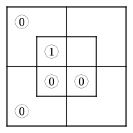 

Let "things" be Universe; $m$="medicine";\
$x$="nasty"; $y$="senna".

All $m$ are $x$; $\therefore$ All $y$ are $x$.\
All $y$ are $m$.

i.e.  Senna is nasty.

[See remarks on No. 7, § 2.]

**21.**  

Let "persons" be Universe; $m$="Jews";\
$x$="rich"; $y$="Patagonians".

Some $m$ are $x$; $\therefore$ Some $x$ are $y'$.\
All $y$ are $m'$.

i.e.  Some rich persons are not Patagonians.

**22.** 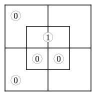 

Let "creatures" be Universe; $m$="teetotalers";\
$x$="that like sugar"; $y$="nightingales".

All $m$ are $x$; $\therefore$ No $y$ are $x'$.\
No $y$ are $m'$.

i.e.  No nightingales dislike sugar.

**23.** 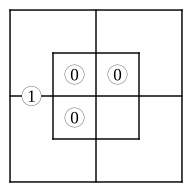 

Let "food" be Universe; $m$="wholesome";\
$x$="muffins"; $y$="buns".

No $x$ are $m$;\
All $y$ are $m'$.

There is 'no information' for the smaller Diagram; so no Conclusion can be drawn.

**24.**  

Let "creatures" be Universe; $m$="that run well";\
$x$="fat"; $y$="greyhounds".

No $x$ are $m$; $\therefore$ Some $y$ are $x'$.\
Some $y$ are $m$.

i.e.  Some greyhounds are not fat.

**25.**  

Let "persons" be Universe; $m$="soldiers";\
$x$="that march"; $y$="youths".

All $m$ are $x$;\
Some $y$ are $m'$.

There is 'no information' for the smaller Diagram; so no Conclusion can be drawn.

**26.**  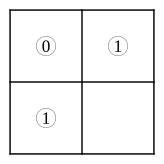

Let "food" be Universe; $m$="sweet";\
$x$="sugar"; $y$="salt".

All $x$ are $m$;     $\therefore$      All $x$ are $y'$.\
All $y$ are $m'$.                 All $y$ are $x'$.

i.e.   Sugar is not salt.\
Salt is not sugar.

**27.**  

Let "Things" be Universe; $m$="eggs";\
$x$="hard-boiled"; $y$="crackable".

Some $m$ are $x$; $\therefore$ Some $x$ are $y$.\
No $m$ are $y'$.

i.e.  Some hard-boiled things can be cracked.

**28.**  

Let "persons" be Universe; $m$="Jews"; $x$="that\
are in the house"; $y$="that are in the garden".

No $m$ are $x$; $\therefore$ No $x$ are $y$.\
No $m'$ are $y$.

i.e.  No persons, that are in the house, are also in\
the garden.

**29.**  

Let "Things" be Universe; $m$="noisy";\
$x$="battles"; $y$="that may escape notice".

All $x$ are $m$; $\therefore$ Some $x'$ are $y$.\
All $m'$ are $y$.

i.e.  Some things, that are not battles, may escape notice.

**30.**  

Let "persons" be Universe; $m$="Jews";\
$x$="mad"; $y$="Rabbis".

No $m$ are $x$; $\therefore$ All $y$ are $x'$.\
All $y$ are $m$.

i.e.  All Rabbis are sane.

**31.** 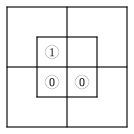 

Let "Things" be Universe; $m$="fish";\
$x$="that can swim"; $y$="skates".

No $m$ are $x'$; $\therefore$ Some $y$ are $x$.\
Some $y$ are $m$.

i.e.  Some skates can swim.

**32.**  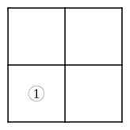

Let "people" be Universe; $m$="passionate";\
$x$="reasonable"; $y$="orators".

All $m$ are $x'$; $\therefore$ Some $y$ are $x'$.\
Some $y$ are $m$.

i.e.  Some orators are unreasonable.

[See remarks on No. 7, § 2.]
